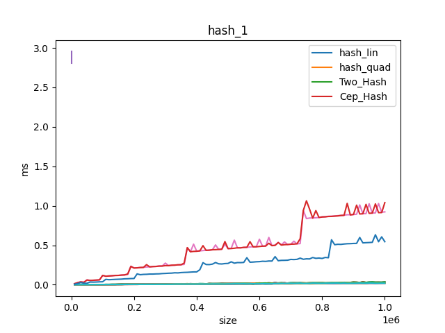
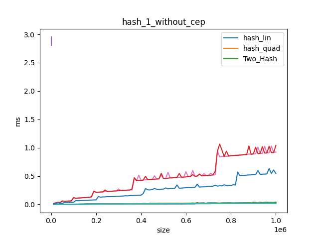
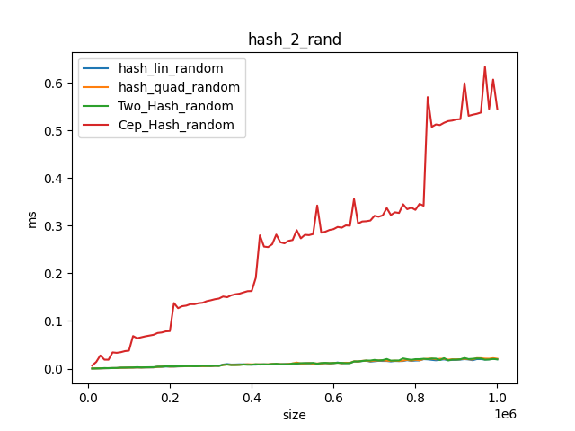
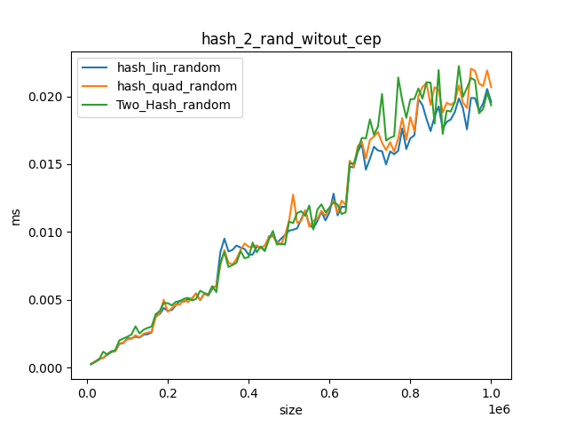
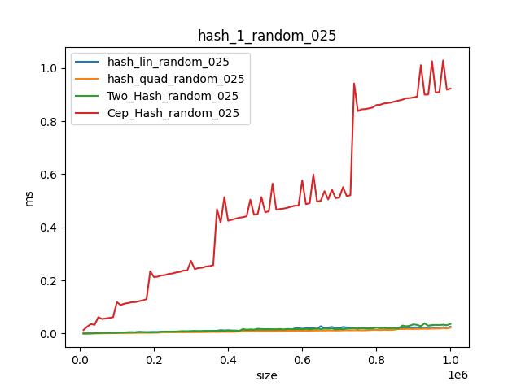
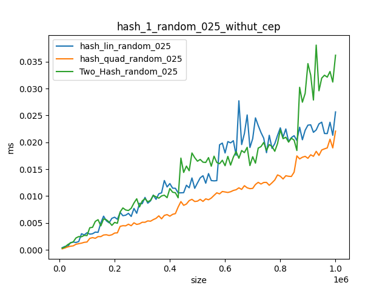
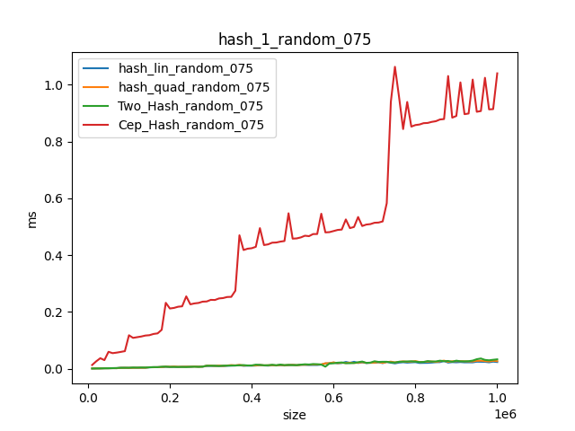
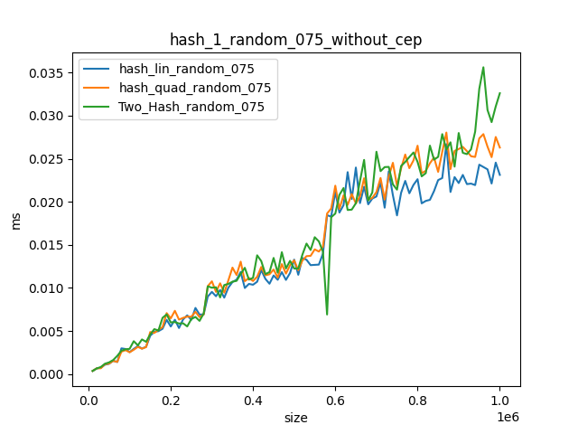

# Лабораторная 5. Сравнение хэш-Таблиц

В данной лабораторной работе 
мы сравнивали эффективность различных функций хэширования, а также различных типов Хэш-таблиц.

## Графики

Для генерации данных Пункта 2.1 следует запустить

    cmake с target = lab_hash

Это запустит тесты и положит их результаты в директорию data

Для генерации данных Пункта 2.3 и 2.3 следует запустить

    cmake с target = lab_hash

Это запустит тесты и lab_hash_ran dom их результаты в директорию data

Для генерации данных Пункта 3 следует запустить

    cmake с target = lab_hash_find

Это запустит тесты и положит их результаты в директорию data

При построении графиков использовался скрипт `graph_ctor.py`. Запустить:

    cmake с target = gen_graph
Это сгенерирует графики из данныз в диретории data и сохранит их в директорию graph
	
	

## Пункт 2. Сравнение Хэш-таблиц 

В лабораторной работе реализованы:

* Хэширование цепочками (hash_cep )
* открытое хэширование с линейным тестированием (hash_lin)
* Используйте открытое хэширование с квадратичным тестированием(hash_quad)
* Используйте открытое хэширование с методом двойного хэширования(hash_two)

Результаты представлены на графике:

Как мы видим, при частом перехэшировании количество calloc и realloc большое в hash_cep(В моей реализации связанного списка массиве)
В two_hash в среднем в два раза чаще считается хэш за счет двух хэш функций и в результате он примерно в два раза медленнее

В итоге у каждой хэш таблице баланс между перехэшированиием и замедлением в работе, в результате большой загруженности достигается при load_factor = 2

Далее я тестировал эти варианты на случайном наборе вставок\удалений\поиска

Результаты представлены на графике:

Как видно при меньшем процентном соотношении вставок, two_hash становится по эффективности таким же, как и остальные две(реализация hash_cep была неудачной для данных тестов)

На следующей таблице представленны результаты при вероятности добавления 0.25 и 0.75 соответсвенно

## Пункт 3 Сравнение Обычного Хэширования с Идеальным

В лабораторной работе реализованы:

* открытое хэширование с линейным тестированием (hash_lin)
* Используйте открытое хэширование с квадратичным тестированием(hash_quad)
* Идеальное хэширование(hash_two)

| Тип Хэш-Таблицы           | Время Работы |
|---------------------------|--------------|
| Идеальное хэширование     | 0.002439     |
| Линейное пробирование     | 0.105749     |
| Квадратичное пробирование | 0.109738     | 

Как и следовало из теории, Идеальное хэширование сильно эффективнее остальных при операции запроса.
 А из за не очень большого load_factor массива подсчет квадратичного хэша в среднем медленнее обработки коллизий.
 
 
